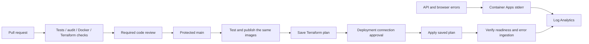

# Azure DevOps CI/CD and Log Analytics

This Terraform bootstrap connects an **existing Azure Repos repository** to two pipelines. It also creates federated Azure identities, service connections, branch protection and deployment checks. It does not create an Azure DevOps organization, upload your repository or deploy resources until you apply it.



## What is automated

- **CI:** Python unit/security/agent contract tests, coverage >=80%, dependency audit, Terraform format/validate/mocked security tests for both stacks, real Docker REST/MCP/navigation integration. Azure Repos PR validation uses a Terraform-managed branch policy; `pr:` YAML triggers are not used for Azure Repos.
- **CD:** runs the same checks on protected `main`, retains successful Docker CI images and pushes those exact local images to ACR. Tags include the build ID and commit SHA. Tags are locked against write/delete after publishing. No image rebuild occurs between integration testing and publishing.
- **Plan:** reads the existing application state without a write lock and publishes `release.tfplan`, a readable plan and commit ID as a restricted pipeline artifact.
- **Apply:** waits for approval on the deployment service connection, obtains fresh federated credentials, checks the source commit, and applies the saved plan. It does not silently create a different plan after approval. An environment lock serializes applies; Terraform state locking remains enabled during apply. A stale plan fails and needs a new run/review.
- **Verification:** checks API readiness, sends one unauthenticated request, expects HTTP 401, then waits up to ten minutes for that exact request ID in Log Analytics. This does not need the application API key. Failure of the check fails the deployment job; it does not automatically roll back infrastructure.

The image test depends on public example.com and downloading the pinned browser image. Network or Docker failures stop publishing. Model evaluations use deterministic fake decisions; no live LLM is called or billed.

## Identity boundaries

| Identity | Permissions |
| --- | --- |
| Plan/build | Reader on the app resource group; AcrPush on its registry; Blob Data Reader on the application state container; a narrow custom role for AzureRM's Container Apps secret-list and Log Analytics shared-key refresh calls |
| Release | Contributor on the app resource group; Blob Data Contributor on application state; conditional RBAC Administrator limited to runtime AcrPull/Key Vault roles for the two runtime identities and Secrets Officer for the designated operator |

Both Azure connections use **workload identity federation**. There is no client secret in YAML, Terraform variables or the pipeline library. Issuer/subject values come from the Azure DevOps provider rather than hardcoded issuer URLs. The pipeline uses the job OIDC endpoint so Terraform can refresh tokens during long operations. [Microsoft federation guidance](https://learn.microsoft.com/en-us/azure/devops/pipelines/release/configure-workload-identity?view=azure-devops), [Terraform Azure backend OIDC](https://developer.hashicorp.com/terraform/language/backend/azurerm).

The plan identity can read sensitive Terraform state and ARM secret metadata/values exposed during refresh. It is a **trusted main-branch identity**, never a PR identity. Only the CD pipeline is authorized to use the connections, and connection branch checks require protected `refs/heads/main`. Deployment approval is attached to the release connection itself, outside editable pipeline YAML. Approvers cannot approve their own requested run. One independent PR reviewer is required. Azure DevOps administrators can override controls; restrict that membership and branch-policy bypass permissions.

Keep the bootstrap identities in a separate resource group, and the bootstrap state in a **separate storage container** that neither pipeline identity can read/write. The application pipeline must not administer the state or federated credentials granting its own permissions. State, saved plans and artifacts can contain provider-computed secrets even though application Key Vault values are not declared in Terraform. Limit artifact access and retention in Azure DevOps project settings.

## 1. Prepare Azure and the repository

1. Complete at least the **foundation** phase in [the application Terraform guide](../terraform/README.md), using remote state. Seed `mcp-api-key` and `scraper-api-key` with the existing initialization script. The pipeline does not initialize/rotate those secrets.
2. Register these Azure resource providers once using a subscription administrator: `Microsoft.App`, `Microsoft.ContainerRegistry`, `Microsoft.KeyVault`, `Microsoft.ManagedIdentity`, `Microsoft.Network`, `Microsoft.OperationalInsights`, `Microsoft.Insights` and `Microsoft.Storage`. Both Terraform providers disable automatic registration because pipelines are scoped to the application resource group.
3. Create a separate resource group for delivery identities and a separate private bootstrap state container. Give the bootstrap operator access to both remote state containers and permission to create role definitions/assignments at the required scopes.
4. Create or select an Azure DevOps organization, project and **Azure Repos Git** repository. Push this project, including `azure-pipelines.yml`, `.azure-pipelines/`, both Terraform roots and their `.terraform.lock.hcl` files, to `main`. Do not push `.env`, keys, outputs, plans or state. GitHub repository integration is not configured by this bootstrap.
5. Make sure the organization has Microsoft-hosted Linux parallel-job capacity. Default runners are `ubuntu-latest`, with Docker available.

The hosted deployment runner must reach the **application state storage endpoint**. If that account is private or firewall-restricted to your network, use an approved VNet-connected, ephemeral Linux agent pool for the CD jobs and adjust `pool` accordingly. Do not run untrusted PRs on a persistent privileged deployment runner. The Key Vault endpoint can remain private: CI/CD does not read its secret values, and the runtime identities resolve references from the VNet.

## 2. Authenticate the bootstrap operator

Use `az login` / `az account set` for Azure. The Azure DevOps provider uses `AZDO_ORG_SERVICE_URL` and a short-lived operator `AZDO_PERSONAL_ACCESS_TOKEN`; the token is only for bootstrapping DevOps resources, not for pipeline deployment.

```powershell
$env:AZDO_ORG_SERVICE_URL = 'https://dev.azure.com/YOUR-ORGANIZATION'
$bootstrapToken = Read-Host 'Azure DevOps bootstrap PAT' -AsSecureString
$env:AZDO_PERSONAL_ACCESS_TOKEN = [System.Net.NetworkCredential]::new('', $bootstrapToken).Password
```

Use an operator allowed to administer project pipelines, repository policies, service connections, checks and environments. Give its temporary PAT only the scopes required by these operations according to your organization's policy. Do not put the PAT in `tfvars`, source files or pipeline variables. Remove the environment variable and revoke the temporary PAT when finished.

## 3. Configure and apply the bootstrap

```powershell
Set-Location deploy/azure-devops
Copy-Item terraform.tfvars.example terraform.tfvars
Copy-Item backend.hcl.example backend.hcl
# Edit both files with your real, nonsecret identifiers.
terraform init -backend-config=backend.hcl
terraform fmt -check -recursive
terraform validate
terraform plan -out=bootstrap.tfplan
# Review permissions, branch policies and approvers before applying:
terraform apply bootstrap.tfplan
terraform output
Remove-Item Env:AZDO_PERSONAL_ACCESS_TOKEN
$bootstrapToken.Dispose()
```

`app_name`, location, retention and `secret_operator_object_id` must match the application stack. The `state_*` variables refer to the **application** state; `backend.hcl` refers to the **bootstrap** state. `approver_ids` are Azure DevOps user/group identity IDs accepted by approval checks, not a display name or an application client ID. At least one approver other than the requester is necessary with the supplied policy.

The bootstrap reads existing runtime identities from the application foundation. If you later replace those identities, reapply this bootstrap to update its constrained role-assignment delegation before releasing. It does not grant unconstrained Owner/User Access Administrator privileges.

## 4. First release

In Azure DevOps > Pipelines, run the new `APPNAME-CD` pipeline from `main`. Subsequent commits to main trigger it automatically. Wait for tests/build/plan, inspect the `reviewed-plan` artifact, and approve the release connection when ready.

The first run can create workload apps if only the foundation exists. Subsequent runs update image tags and any reviewed application Terraform changes. The release uses the application stack's default tags/settings plus the nonsecret variables installed by the bootstrap; if you have customized application variables, add explicit matching pipeline configuration before deployment to avoid reverting them. Temporary Key Vault operator IP access is removed by the default application configuration.

Browser deployments/restarts invalidate active sessions. Coordinate maintenance. Pipeline image tags are locked; recovery should use a reviewed source revert/new release, or an explicitly reviewed plan referencing a previously retained tag. Never automatically destroy/recreate the stack on a failed health check.

## Error logs in Log Analytics

Both the API and worker emit sanitized JSON errors to stderr, including `timestamp`, `severity`, `service`, `revision`, `request_id`, status and diagnostic code. Container Apps forwards console and system logs to the existing `log-APPNAME` workspace. No ingestion key is embedded in Python and no duplicate diagnostic sink is installed.

The application Terraform installs two saved searches under **Retail scraper**: `Structured scraper errors` and `Container platform failures`. Key Vault audit diagnostics remain enabled. Retention defaults to 30 days.

```kusto
ContainerAppConsoleLogs_CL
| where TimeGenerated > ago(1h)
| extend Error = parse_json(Log_s)
| where tostring(Error.severity) == "ERROR"
| project TimeGenerated, ContainerAppName_s,
    RequestId=tostring(Error.request_id), Status=toint(Error.status),
    Code=tostring(Error.code), Message=tostring(Error.message)
```

For one incident, add `| where RequestId == "REQUEST-ID"` after the projection. For server-side failures only, filter `Status >= 500`; client validation/authentication rejections are logged too. Browser raw stderr/HTML and secret values are deliberately not included in these application records. Platform image-pull/startup failures appear in `ContainerAppSystemLogs_CL`.

The pipeline's own build/task logs and test artifacts remain in **Azure DevOps**. This implementation forwards **application and Container Apps platform errors** to Log Analytics, not full Azure DevOps job logs. No email/action-group notifications are configured.

To repeat the ingestion check manually after deployment:

```powershell
az extension add --name log-analytics
python scripts/verify_azure_logs.py --endpoint 'https://YOUR-APP.azurecontainerapps.io/mcp' --workspace 'WORKSPACE-CUSTOMER-ID' --app-name 'APPNAME-mcp'
```

Use the `log_workspace_id` Terraform output (workspace/customer GUID). Run with an Azure identity permitted to query that workspace. First ingestion/table creation can take several minutes. If verification times out, check routing, workspace permissions and Container Apps system logs; do not disable the check to label an unverified release healthy.

## Validation limits

Local Python tests, Terraform validation and mocked security plans can run without Azure or DevOps credentials. These checks do not prove Azure DevOps YAML compilation, your tenant's RBAC/federation settings, network reachability or actual ingestion. No Azure DevOps resources have been created by this coding task. Run a first release in your subscription to establish those integration results.
