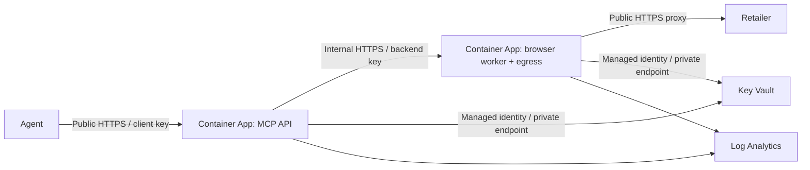

# Azure Container Apps deployment

The current Terraform stack hosts the MCP API directly in **Azure Container Apps**. There is no Azure Function, Functions storage or Functions deployment step.



The API app accepts public HTTPS. The browser app has **internal ingress on port 8001**, so only apps inside this Container Apps environment can address it. The environment uses an external load balancer for the public API. [Azure ingress visibility](https://learn.microsoft.com/en-us/azure/container-apps/ingress-how-to).

## Resources and access

Terraform creates a resource group, VNet/delegated subnet, Container Apps environment, two container apps, ACR, two managed identities, Key Vault with private endpoint/DNS, Log Analytics and Key Vault audit diagnostics. Logs retain 30 days by default.

| Secret | Access |
| --- | --- |
| `mcp-api-key` | Agent authenticates to public API; API identity can read it |
| `scraper-api-key` | API authenticates to browser; API and browser identities can read it |

Both identities have AcrPull. The browser identity cannot read the client key. A designated secret operator has Key Vault Secrets Officer. Terraform stores secret references, never secret values; no secret-value resources/data sources are used. ACR admin and anonymous access are disabled. Key Vault uses RBAC, private access by default, purge protection and 90-day soft deletion.

Both apps use min/max replicas 1. A browser lease persists across agent tool calls on that worker, and reserves its single browser slot for at most 180 seconds. API requests can arrive at any time but receive a busy response while another lease owns Chrome. Do not scale the backend beyond one replica without session routing and external lease coordination. Revisions/restarts invalidate sessions; schedule deployments and secret rotations as maintenance and restart the agent's research afterward.

## 1. Prerequisites and Terraform state

Install Terraform >=1.9 (CI uses 1.13.5), Azure CLI and Az.Accounts/Az.KeyVault PowerShell modules. The provider is locked to AzureRM 5.6.0. Select a region with Container Apps Consumption capacity; the example defaults to Brazil South.

The deployment operator needs resource creation and role-assignment privileges (for example Contributor plus User Access Administrator). Image builds need ACR Tasks permission. Create a Cost Management budget: two always-running apps, the registry, private endpoint and monitoring are billable.

```powershell
az login
az account set --subscription '<subscription-id>'
az ad signed-in-user show --query id -o tsv
```

Before Terraform, create a separate state StorageV2 account/private `tfstate` container through your organization bootstrap process or Azure Portal. Disable anonymous access/shared keys, require TLS 1.2, enable blob versioning and soft deletion, and grant the runner Storage Blob Data Contributor on the state container. Restrict networking to the runner; private endpoints require VNet connectivity and DNS. Do not create the state account inside the same state it must hold. [Azure Terraform backend authentication](https://developer.hashicorp.com/terraform/language/backend/azurerm).

Copy/edit the examples in `deploy/terraform`. `backend.hcl` points to that pre-created state account and uses Entra authentication. Treat state and saved plans as sensitive even without application passwords; keep their working directory outside shared/OneDrive folders for a production deployment.

## 2. Foundation

```powershell
# From repository root:
Set-Location deploy/terraform
Copy-Item terraform.tfvars.example terraform.tfvars
Copy-Item backend.hcl.example backend.hcl
# Edit both files before proceeding.
terraform init -backend-config=backend.hcl
terraform fmt -check -recursive
terraform validate
terraform plan -out=foundation.tfplan
# Review changes and costs before applying:
terraform apply foundation.tfplan
```

Keep `deploy_workloads=false`. Set `subscription_id`, a globally unique lowercase name (6–16 letters/digits, starting with a letter), and the operator's Entra **object ID** in `secret_operator_object_id`.

To seed secrets from your workstation, temporarily set `operator_ipv4_cidrs=["YOUR.PUBLIC.IP/32"]`. This opens Key Vault only to that IP and still requires RBAC. Alternatively leave it empty and seed from a VNet-connected administrator. Wait for role propagation if initially denied.

## 3. Secrets and images

From the repo root:

```powershell
Connect-AzAccount
Set-AzContext -Subscription '<subscription-id>'
.\scripts\initialize_azure_keys.ps1 -VaultName 'kv-YOURNAME'
az acr build --registry YOURNAMEacr --image html-scraper:v2 --file Dockerfile .
az acr build --registry YOURNAMEacr --image html-scraper-browser:v2 --file Dockerfile.browser .
```

The initialization script generates two independent 256-bit secrets, never prints them and preserves existing secret names. Do not pass values in Terraform variables or build arguments. Use new image tags for every release, then set `api_image_tag` and `browser_image_tag` to those tags.

## 4. Workloads

Set `deploy_workloads=true`. Remove temporary vault access (`operator_ipv4_cidrs=[]`) once the secrets exist.

```powershell
Set-Location deploy/terraform
terraform plan -out=workloads.tfplan
terraform apply workloads.tfplan
terraform output
```

There is **no** `func publish` step. ACR image deployment runs the existing `app.main:app` API and `app.browser_worker:app` worker. Role propagation may delay initial pulls/Key Vault resolution; inspect Container Apps system logs and retry after propagation rather than copying plaintext keys into settings.

Use the exact `mcp_endpoint` output. Configure the agent for Streamable HTTP and the `X-API-Key` header containing `mcp-api-key`, supplied by the agent platform's secret store. Never give the agent the backend key or managed-identity credentials. A browser visit without the header should return 401.

Check API `/readyz`, MCP tools/list, then open/inspect/close a session on a public fixture you control. Verify invalid keys and private addresses fail. See [agent navigation usage](../../docs/AGENT-NAVIGATION.md) for searching and extracting PS5 details.

## Migration from the previous Functions Terraform

No deployment has been performed by this coding task. If you already applied the old stack yourself, **do not blindly apply this configuration**. Back up remote state and inspect a saved plan. It removes the Function, Functions plan/storage and old identities; changing environment load-balancer type can replace the environment and its dependent apps. It also changes the backend from a three-container REST API app to a two-container private browser worker.

Use a new globally unique name and a separate backend state key for a parallel rollout when avoiding downtime. Seed new vault secrets, build images, validate the new MCP endpoint, switch agents, then separately review retirement of the old stack. Existing browser sessions cannot migrate.

## Logs, rotation and maintenance

Container Apps captures stdout/stderr for both apps into Log Analytics. Existing structured error records include request IDs without HTML, keys or raw exception contents. Workstation error files remain local; cloud logs are in Azure Monitor. Scraped HTML is not automatically archived in Azure. The agent CLI writes timestamped research reports on the agent host.

```kusto
ContainerAppConsoleLogs_CL
| where TimeGenerated > ago(1h)
| where Log_s contains "REQUEST-ID"
| project TimeGenerated, ContainerAppName_s, Log_s
```

Create alerts for repeated failures, unhealthy replicas, Key Vault denials and budget thresholds. Restrict log-reader rights and avoid logging page bodies or credentials.

Rotate secrets by creating new versions through an authorized VNet-connected operator. Versionless references are used: Container Apps checks for new versions within 30 minutes and restarts active revisions whose environment variables reference the changed secret. Coordinate maintenance and verify both apps have refreshed before resuming research. Rotate `mcp-api-key` in agents too; rotating `scraper-api-key` affects both apps. Old/new simultaneous acceptance is not implemented. [Container Apps secret rotation](https://learn.microsoft.com/en-us/azure/container-apps/manage-secrets).

## Limits and further hardening

This stack uses one shared client key and one browser lease; it is not a multi-tenant service. Session ownership maps to that shared credential. Add Entra authentication with per-principal ownership, authorization and quotas before exposing it to unrelated users. API Management and Defender image scanning are optional next steps, not resources created here.

The private browser app and egress sidecar share networking and a managed identity. Chrome is configured to use the validating proxy, but Azure does not enforce Compose's isolated Chrome network. A browser exploit could bypass that proxy or reach the app identity. For stronger isolation, use a dedicated identity-free browser segment plus enforced outbound firewall rules; internal ingress alone is not outbound isolation.

Website actions use conservative search/link heuristics, public HTTPS/DNS policy and bounded execution. They are not a guarantee against every site's server-side effects or prompt injection. The external agent must treat all site content as untrusted. No login/checkout or arbitrary-script tool is provided.

Review `terraform plan -destroy` before removal. Key Vault purge protection intentionally prevents immediate reuse of a deleted vault name. CI's mocked Terraform tests establish configuration invariants, not a live Azure acceptance test.


## Automated delivery

Use [the Azure DevOps bootstrap](../azure-devops/README.md) after the foundation and secret initialization. The application provider now disables automatic resource-provider registration so scoped pipeline identities can run it. Have a subscription administrator register Microsoft.App, Microsoft.ContainerRegistry, Microsoft.KeyVault, Microsoft.ManagedIdentity, Microsoft.Network, Microsoft.OperationalInsights, Microsoft.Insights and Microsoft.Storage once before provisioning.

Application and worker errors now carry severity/service/revision metadata. Terraform installs saved searches for structured errors and Container Apps platform failures. The CD pipeline verifies actual ingestion by request ID after applying an approved plan.

## Optional retail research job

Set `enable_research_agent=true` to add the isolated GPT-5 mini agent, identity, private Blob reports/lease and manual Container Apps Job. Prepare `openai-api-key` in Key Vault and the `Dockerfile.agent` image before workload deployment. Use `agent_image_tag` for its release. Existing browser/API identities receive no model key. See [the agent runbook](../../docs/RETAIL-AGENT.md).
